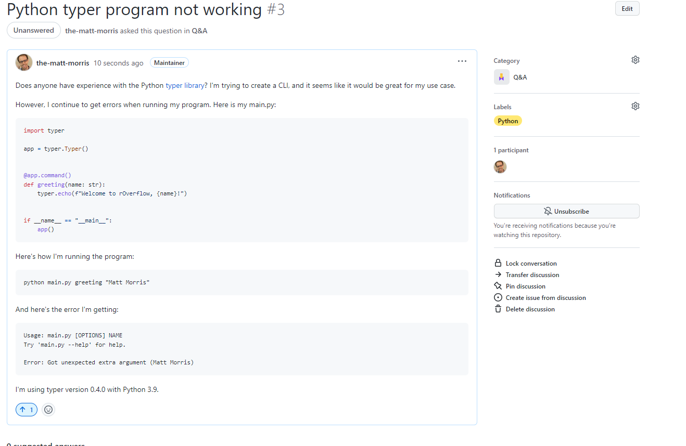
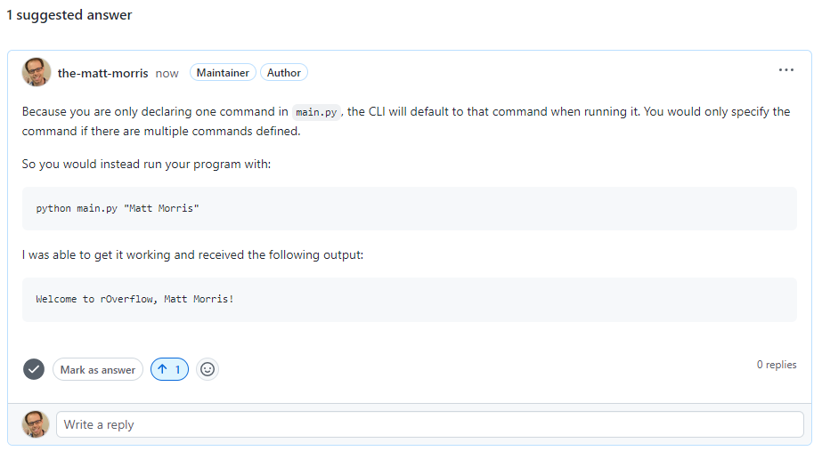
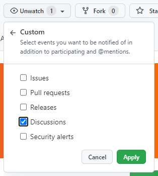

# Welcome to rOverflow! :wave:

Thank you for your interest in knowledge sharing!  This is a place to ask software questions, search for answers to previously asked questions, share knowledge on a software topic, or have general software-related discussions with the RSG community.

This repo is primarily a hacky way to do StackOverflow without paying for [StackOverflow for Teams](https://stackoverflow.co/explore-teams/).

rOverflow uses [GitHub Discussions](https://github.com/RSGInc/rOverflow/discussions) to facilitate knowledge sharing.  It is expected that most of the discussions will be [Q&A](#qa), but there are several [discussion categories](https://github.com/RSGInc/rOverflow/discussions/categories) to be aware of:

* [Q&A](#qa)
* [Show and tell](#show-and-tell)
* [General](#general)

## Q&A

This a place for the broader community to contribute to and gain from questions around software.  Questions requiring support from IT should not be posted here, but instead be taken to the [service desk](https://servicedesk.rsginc.com/support/home).

A question that fits the intended purpose of this project should meet the following criteria:
1. Be answerable
2. Not be directed towards IT

> :white_check_mark: **Want good answers**?
> 
> A few pointers to ensure you post a good question that will lead to good answers:
> 
> :mag: Search the internet and this forum to see if the question has already been answered.
> 
> :question: Summarize your problem/question.
> 
> :page_with_curl: Describe any methods you've tried that haven't worked.
> 
> `<>` Share code snippets or links to code so others can reproduce the problem.

### Examples

Below are some examples to serve as inspiration (or not) for types of questions to post here.

#### Valid Question

> Does anyone have experience with the Python [typer library](https://github.com/tiangolo/typer)?  I'm trying to create a CLI, and it seems like it would be great for my use case.
> 
> However, I continue to get errors when running my program.  Here is my `main.py`:
> 
> ```python
> import typer
> 
> app = typer.Typer()
> 
> 
> @app.command()
> def greeting(name: str):
>     typer.echo(f"Welcome to rOverflow, {name}!")
> 
> 
> if __name__ == "__main__":
>     app()
> ```
>
> Here's how I'm running the program:
> ```
> python main.py greeting "Matt Morris"
> ```
>
> And here's the error I'm getting:
> ```
> Usage: main.py [OPTIONS] NAME
> Try 'main.py --help' for help.
> 
> Error: Got unexpected extra argument (Matt Morris)
> ```
>
> I'm using typer version `0.4.0` with Python `3.9`.

#### Invalid

```
I'm having trouble connecting to the Q: drive.  Could someone help with that?
```

This question should be directed to the [service desk](https://servicedesk.rsginc.com/support/home).

## Asking Questions

1. Create a [new discussion](https://github.com/RSGInc/rOverflow/discussions/new) in this project.
2. Give the discussion an appropriate title.
3. Select `Q&A` as the Category for the discussion.
4. Ask your question in the discussion description, following [good question practices](#whats-in-scope).
5. Assign label(s) that are relevant to your question.



> :blue_book: **Note**: If your question requires a project label that doesn't yet exist, feel free to [create one](https://github.com/RSGInc/rOverflow/issues/labels)!

### Responding to Questions

To respond to the question with a potential solution or clarifying question, write comments in the issue.

Other users may also "upvote" comments that are good answers, especially in the case where there are multiple answers provided to a question.



In some cases, the OP finds an answer to their own question.  We ask that they respond to their own issue with the solution so [others may benefit](https://xkcd.com/979/).

### Closing a Solved Question

We ask that the OP click the `Mark as answer` button next to a satisfactory solution that has been provided so it's clear that the problem has been solved and others can quickly find the solution to the problem.

### Searching for Answers

Others may head to the [discussions](https://github.com/RSGInc/rOverflow/discussions) and use the search box to search for previously asked questions.  They may also use filter to specific labels using the "Label" dropdown or filter to answered/unanswered questions using the "Filter" dropdown.

## Show and tell

If you learned something new or finally figured that thing out that you beat your head against the wall for hours over and want to share the wealth, create a new [show and tell](https://github.com/RSGInc/rOverflow/discussions/new?category=show-and-tell) discussion!

## General

This is a place for general software discussions.  These typically ask a question that solicits feedback, but differ from [Q&A](#qa) in that they aren't soliciting a single specific answer to solve a problem.

## **WATCH THIS REPO!!**

To ensure the success of knowledge sharing at RSG, watch this repo so you can contribute to and benefit from questions being asked:


